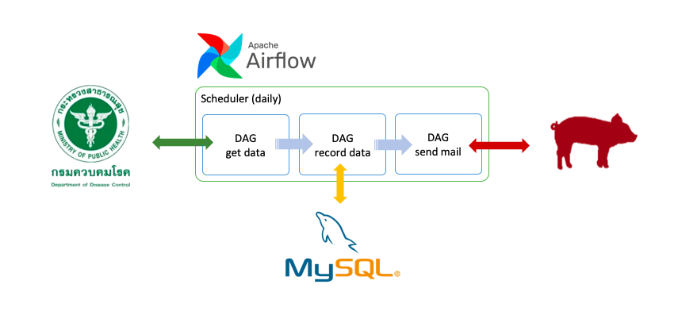
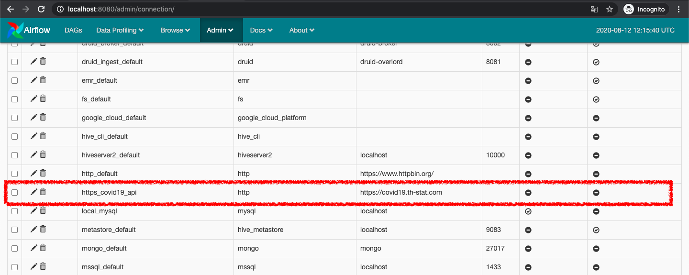
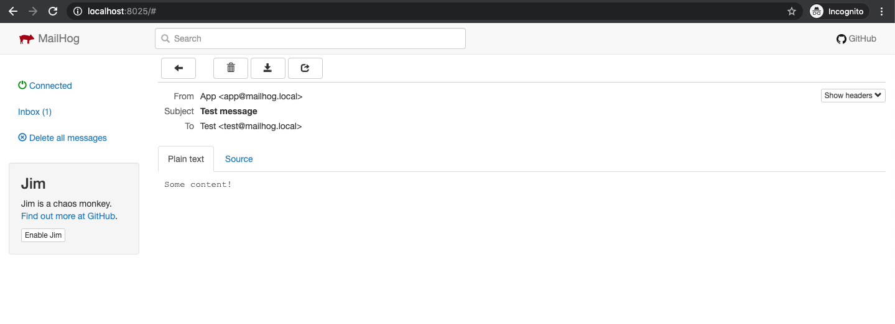
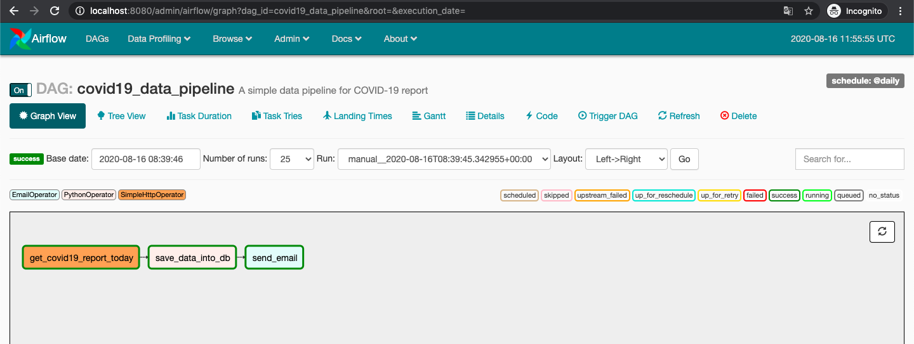
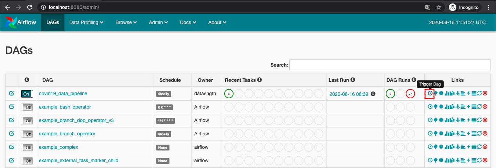
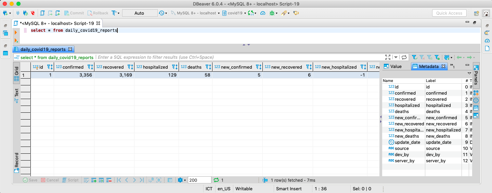
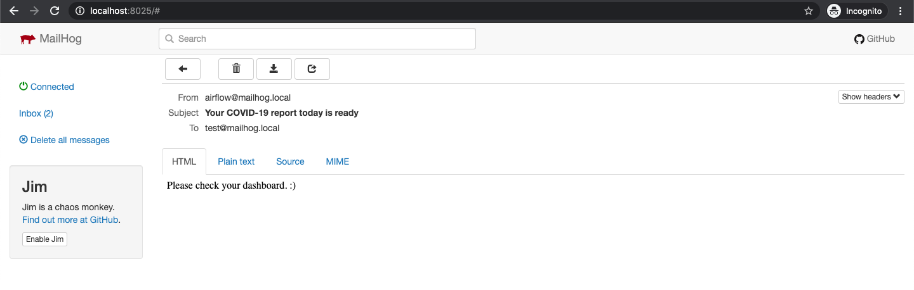
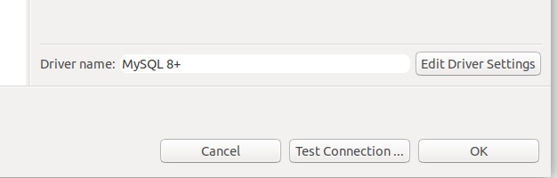
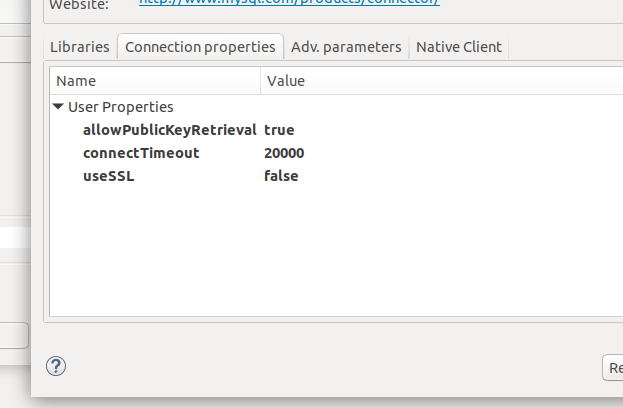

# COVID-19 Fetcher



This project shows you how-to-config or set up data pipeline by using `Airflow` to fetch `COVID-19` data from data source(`Department of Disease Control`) then notice developer via email.

## Requirements

 - [x] Airflow
 - [x] MySQL
 - [x] MailHog
 - [x] Docker daemon
 - [ ] [DBeaver](https://dbeaver.io/) (optional)

## Preparing Environments

### Dockerize

```bash
# Run docker-compose with specific process
$ sh run.sh
```

### Undockerize

For undockerize `Airflow` service, you MUST copy pipeline script from `./src/covid19-data-pipeline.py` to your `Airflow` directory by default is `~/airflow/dags`

then run script below :

```bash
# @root of the project

# Airflow

# Start web server to manage your Airflow service
sh start-airflow-webserver.sh
# Start Airflow scheduler
sh start-airflow-scheduler.sh

# Database

# Start MySQL (using Docker)
sh start-db.sh
# Create "data" folder to bind DB volume
mkdir -p data

# Mail

# Start mail server (using Docker)
sh start-mailhog.sh
```

### Database

After start Dockerize services or Undockerize services, please don't forget initial your database :

```sql
CREATE DATABASE covid19;
USE covid19;
GRANT ALL PRIVILEGES ON covid19.* TO 'root'@'%' IDENTIFIED BY 'root';
GRANT ALL PRIVILEGES ON covid19.* TO 'root'@'localhost' IDENTIFIED BY 'root';
```

**note** : for Dockerize services, intial file is in `./database/init.sql`.

## Setup Pipeline

### Airflow
Ref. https://airflow.apache.org/

#### Create DAG

`Directed Acyclic Graph` or `DAG` is a finite directed graph with no directed cycles. You can declare any tasks or workflow/pipeline in `DAG` scope :

```python
from datetime import datetime
from airflow import DAG

# ...

default_args = {
    'owner': 'YOUR_NAME',
    'start_date': datetime(2020, 7, 1),
    'email': ['YOUR_MAIL_HOST']
}

with DAG('covid19_data_pipeline',
  schedule_interval='@daily',
  default_args=default_args,
  description='A simple data pipeline for COVID-19 report',
  catchup=True) as dag:

  # ...
```

For the example, I'm preparing to fetch daily COVID-19 data by start executing on 2020-07-01.

> <br>note:
> *Now we ready to declare our tasks.*
> <br>

#### Task#1 (`t1`) : Fetch the data by using SimpleHttpOperator

[`i`] **What is `SimpleHttpOperator`?**, more detail [here](https://airflow.apache.org/docs/stable/_api/airflow/operators/http_operator/index.html).

`SimpleHttpOperator` reference to `http_conn_id`, you need to set it to host of the API via :

Navigator or Toolbar in Airflow's UI > Admin > Connections



In this case, I set the connection ID to `https_covid19_api` :

 - **Conn Id** : https_covid19_api
 - **Conn Type** : HTTP
 - **Host** : https://covid19.th-stat.com

In your DAG should look like this :

```python
from airflow.operators.http_operator import SimpleHttpOperator

# ...

# Don't forget allow DAG to access context in XComms
default_args = {
    ...,
    'provide_context': True  # to support task instance for XComms with kwargs['ti']
}

with DAG(...) as dag:

  # Calls target endpoint on an HTTP system
  t1 = SimpleHttpOperator(
      task_id='get_covid19_report_today',
      method='GET',
      http_conn_id='https_covid19_api',
      endpoint='/api/open/today',
      headers={"Content-Type":"application/json"},
      xcom_push=True,  # Keep context or return value in this task
      dag=dag
  )

  # ...

```

[`i`] **What is Cross-communication (or XComs) ?**, more detail [here](https://airflow.apache.org/docs/stable/concepts.html?highlight=xcom#xcoms).


### MySQL

#### Create COVID-19 data table

Create database name `covid19`.

then create table:

```sql
CREATE TABLE daily_covid19_reports (
  id INT(6) UNSIGNED AUTO_INCREMENT PRIMARY KEY,
  confirmed INT(6),
  recovered INT(6),
  hospitalized INT(6),
  deaths INT(6),
  new_confirmed INT(6),
  new_recovered INT(6),
  new_hospitalized INT(6),
  new_deaths INT(6),
  update_date DATETIME,
  source VARCHAR(100),
  dev_by VARCHAR(100),
  server_by VARCHAR(100)
);
```

**note**: the schema based on `Department of Disease Control`'s API.

#### Task#2 (`t2`) : Record the data to database

Create function to record the data, the function will get data/context from `XComms` by reference to `ti` in context object:

```python
def save_data_into_db(**kwargs):
  # ... 

  # Get task instance from context
  ti = kwargs['ti']
  # Pull the previous data
  data = ti.xcom_pull

  # ... 
```

Full source code :

```python
def save_data_into_db(**kwargs):

    import logging
    import sys, traceback
    import traceback

    LOGGER = logging.getLogger("airflow.task")
    LOGGER.info("Saving data...")

    # Pulling data from previous task instance (or "ti")
    ti = kwargs['ti']
    LOGGER.info("Sync XCom to pull data from previous task by ID...")

    data = ti.xcom_pull(task_ids='get_covid19_report_today')
    LOGGER.info("Data : {}".format(data))

    data = json.loads(data)

    # "covid19_db" was declare in Admin > Connections via AirFlow's UI
    mysql_hook = MySqlHook(mysql_conn_id='covid19_db')
        
    insert = """
        INSERT INTO daily_covid19_reports (confirmed, recovered, hospitalized, deaths, new_confirmed, new_recovered, new_hospitalized, new_deaths, update_date, source, dev_by, server_by)
        VALUES (%s, %s, %s, %s, %s, %s, %s, %s, %s, %s, %s, %s);
    """

    dt = datetime.strptime(data.get('UpdateDate'), '%d/%m/%Y %H:%M')
    mysql_hook.run(insert, parameters=(data.get('Confirmed'),
                                    data.get('Recovered'),
                                    data.get('Hospitalized'),
                                    data.get('Deaths'),
                                    data.get('NewConfirmed'),
                                    data.get('NewRecovered'),
                                    data.get('NewHospitalized'),
                                    data.get('NewDeaths'),
                                    dt,
                                    data.get('Source'),
                                    data.get('DevBy'),
                                    data.get('SeverBy')))
```

**note**: `mysql_conn_id` same as `http_conn_id`, you need to create MySQL's connection first.

 - **Conn Id** : covid19_db
 - **Conn Type** : MySQL
 - **Host** : airflow-mysql (this host name refer to container name in docker-compose.yml, you can change it to your mysql instance instead)
 - **Schema** : covid19
 - **Login** : root
 - **Password** : root
 - **Port** : 3306

then

Let's create **task#2** :

```python

from airflow.operators.python_operator import PythonOperator

# ...

with DAG(...) as dag:

  t2 = PythonOperator(
    task_id='save_data_into_db',
    python_callable=save_data_into_db
  )
```

### MailHog

To send an email, you can use `MailHog` to handle it. Ref. https://github.com/mailhog/MailHog

Alternative, run with docker that I provided:

```bash
$ sh start-mailhog.sh
```

**note**: default email account is `test@mailhog.local`

#### Test send mail to MailHog

Install `mhsendmail`, ref. https://github.com/mailhog/mhsendmail.

```bash
$ go get github.com/mailhog/mhsendmail
```

send mail (you need to run `MailHog` first)

```bash
mhsendmail test@mailhog.local <<EOF
From: App <app@mailhog.local>
To: Test <test@mailhog.local>
Subject: Test message

Some content!
EOF
```

you should see the content in your inbox :



#### Task#3 (`t3`) : Send an EMail

```python
from airflow.operators.email_operator import EmailOperator

# ...

with DAG(...) as dag:

  # ...

  t3 = EmailOperator(
    task_id='send_email',
    to=['test@mailhog.local'],
    subject='Your COVID-19 report today is ready',
    html_content='Please check your dashboard. :)'
  )
```

#### Task Relations

Finally, don't forget set relation between task:

```python

# ...

with DAG(...) as dag:

  # ...

  t1 >> t2 >> t3

```

it should look like this :



## Manual start pipeline

Normally I set the schedule of this DAG to be daily task. To test the pipeline, you can press `Trigger Dag` button on your DAG in DAGs page :



the result after run this DAG, you should :

see the data in database :



received an email that has content like this :



## Issues

#### *MySQL 8+ : Public Key Retrieval is not allowed*

To change the settings on Dbeaver:

1) Right click your connection, choose "Edit Connection"

2) On the "Connection settings" screen (main screen) click on "Edit Driver Settings"



3) Click on "Connection properties"

4) Right click the "user properties" area and choose "Add new property"

5) Add two properties: "useSSL" and "allowPublicKeyRetrieval"

6) Set their values to  "false" and "true" by double clicking on the "value" column



Save and re-test the connection. Hopefully it should work!

#### *Authentication plugin 'caching_sha2_password' cannot be loaded*

Full error message :
> *Authentication plugin 'caching_sha2_password' cannot be loaded: /usr/lib/x86_64-linux-gnu/mariadb18/plugin/caching_sha2_password.so: cannot open shared object file: No such file or directory*

It occurred on MySQL8+, I'm found many method to solve it but it's not work for me on Airflow container. So I changed MySQL container image from `8` to `5.7`.

## License

MIT